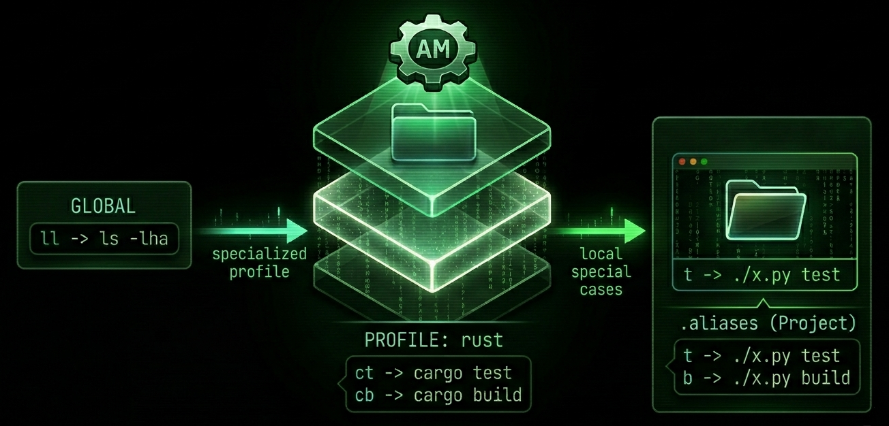
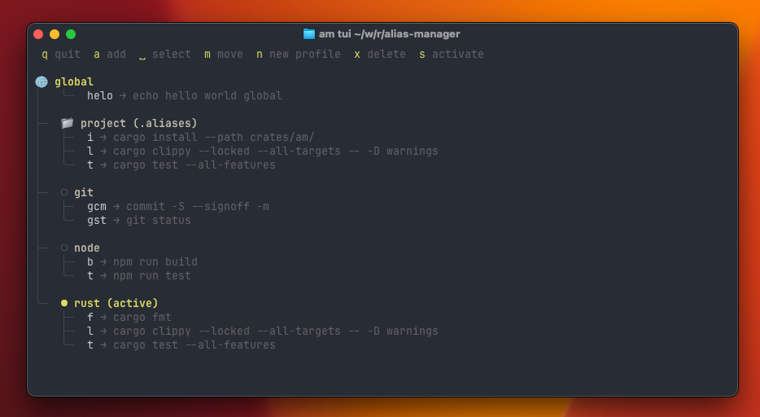
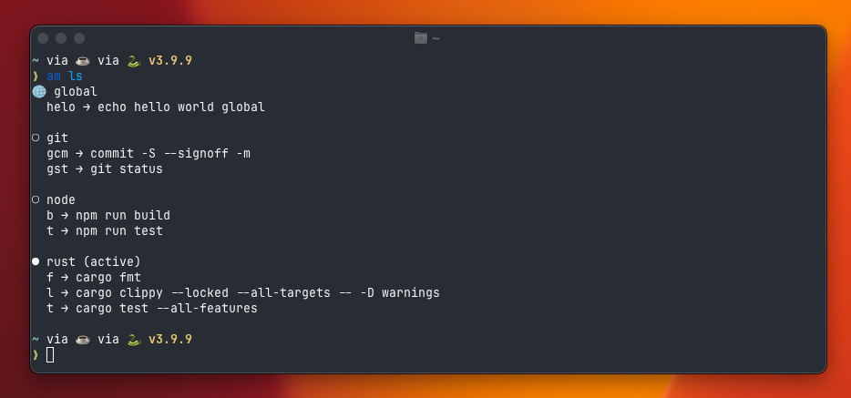

# amoxide (am) - the alias manager

<p align="center">
  
</p>

> amoxide (`am`) is for lazy folks like me. It helps to manage your shell aliases either globally or profile or project specific.
>
> Install: `cargo install amoxide` — the binary is called `am`.
> For the interactive TUI: `cargo install amoxide-tui` — the binary is called `am-tui`, or launch via `am tui`.

Q: What does Globally mean?
A: It's as a regular shell alias right now works - always present.

Q: What is Profile specific then?
A: A Profile is simply a name like `node development` or `git stuff` under which aliases are collected - like a category of purpose for aliases.

Q: What is then project specific?
A: In a project context (locally) available, like you are working on this very rust backend - with project specific aliases.

Note: Profiles can be composed upon another. Like your node profile should leverage some git aliases, then `node development -> git stuff` would cause they are loaded upwards the dependency tree.


## Productivity Tip (Opinionated)

I personally put *a lot* of aliases on the project level, so that I can be super lazy. 

For example in this project I have:

- installing the binary by `cargo install --path crates/am` becomes just `i`
- running tests by `cargo test` becomes `t`
- running lint checks by `cargo clippy --all-targets --all-features -- -D warning` becomes `l`

```sh
am profile add rust

## now adding the alias from above for the profile `rust`
am add -p rust t cargo test
am add -p rust l cargo clippy --all-targets --all-features -- -D warning
```

Then if I find myself often doing the same things in several projects, like coding in rust, then introduce a profile for it. And a profile for `git stuff` or `k8s` and so on.

Last mile, if I need specialization profiles a specific git workflow, I use profile inheritance.

```sh
# create the git profile first, with one alias
am p a git
am a -p gm git commit -S --signoff -m

# create the git convential commit profile, that inherits from git
am profile add git-conventional --inherits git

# now lets get specific with `gmf`
am add -p git-conventional gmf "gm feat: {{@}}"

gmf "my feature"
# → gm feat: my feature
# → git commit -S --signoff -m feat: my feature
```

## Screenshots

- `am tui` launches the tui to navigate, select, move, add, and delete aliases visually:

<p align="center">
  
</p>

- `am ls` the regular cli

<p align="center">
  
</p>

## Installation

```shell
cargo install amoxide          # installs the `am` binary
cargo install amoxide-tui      # installs the `am-tui` interactive interface (optional)
```

The crate is called `amoxide`, but the binary it installs is simply `am` (short for amoxide).

## Setup

Add one line to your shell config:

```fish
# ~/.config/fish/config.fish
am init fish | source
```

```zsh
# ~/.zshrc
eval "$(am init zsh)"
```

This does two things:
1. Loads aliases from your active profile into the current shell
2. Installs a cd hook that automatically loads/unloads project aliases (from `.aliases` files) when you change directories

To verify the setup is correct, run:

```shell
am status
```

## Usage by Example

### Adding and removing aliases

```shell
$ am add "ll ls -lha"
$ am add gs git status         # quotes on the command are optional
$ am remove gs                 # remove from active profile
$ am r gs                      # short form
$ am remove -p rust ct         # remove from a specific profile
```

Short form works too:

```shell
$ am a l ls -lha
#    ^ ^ ^-----^
#    | |       |
#    | |       +---- this is alias command `ls -lha`
#    | +---- this is the alias name `l`
#    +---- this is the verb `add`
```

### Parameterized aliases

Aliases can use `{{1}}`, `{{2}}`, ... for positional arguments and `{{@}}` for all arguments:

```shell
# Compose aliases with argument templates
am add -p git cm "git commit -S --signoff -m {{@}}"
am add -p git-conventional cmf "cm feat: {{@}}"

cmf my feature description
# → cm feat: my feature description
# → git commit -S --signoff -m feat: my feature description

# Positional arguments
am add greet "echo Hello {{1}}, welcome to {{2}}"
greet Alice Wonderland
# → echo Hello Alice, welcome to Wonderland
```

If your command literally contains `{{N}}` (e.g., in awk), use `--raw` to disable template detection:

```shell
am add --raw my-awk "awk '{print {{1}}}'"
```

### Profiles

Profiles let you group aliases by context (e.g., `rust`, `node`, `git`):

```shell
# Add a profile
$ am profile add rust
$ am p a rust                  # short form

# Add a profile that inherits from another
$ am profile add rust --inherits git

# Set the active profile
$ am profile set rust
$ am p s rust                  # short form

# Remove a profile (asks for confirmation if it has aliases)
$ am profile remove rust
$ am p r rust -f               # skip confirmation

# Add aliases to a specific profile
$ am add -p rust ct "cargo test"
$ am add -p rust cb "cargo build"

# List all profiles, aliases, and active project aliases
$ am profile                   # default action
$ am profile list              # explicit
$ am l                         # shortest form
```

The active profile's aliases are loaded on every shell start via `am init`.

Listing profiles shows a tree with inheritance:

```
○ git
│ gs → git status
│ gp → git push
│
├─○ node
│   nr → npm run
│
╰─● rust (active)
    ct → cargo test
    cb → cargo build
```

If you're inside a project with a `.aliases` file, the listing also shows those:

```
○ git
│ gs → git status
│
╰─● rust (active)
    ct → cargo test

📁 project aliases (.aliases)
  t → ./x.py test
  b → ./x.py build
```

### Project aliases (`.aliases` file)

You can add project-local aliases with the `-l`/`--local` flag:

```shell
$ cd ~/my-project
$ am add -l t "./x.py test"   # writes to .aliases in current directory
$ am add -l b "./x.py build"
```

If no `.aliases` file exists, one is created in the current directory. If a `.aliases` already exists further up the directory tree, you'll be asked whether you meant to add to that one instead.

You can also create or edit the `.aliases` file directly:

```toml
# /path/to/my-project/.aliases
[aliases]
t = "./x.py test"
b = "./x.py build"
```

These aliases are automatically loaded when you `cd` into the project (or any subdirectory) and unloaded when you leave. Works like direnv, but for aliases.

Under the hood, `am init` installs a cd hook that calls `am hook <shell>` on every directory change. The hook walks up from the current directory looking for a `.aliases` file (stopping before `$HOME`), unloads any previously active project aliases, and loads the new ones.
